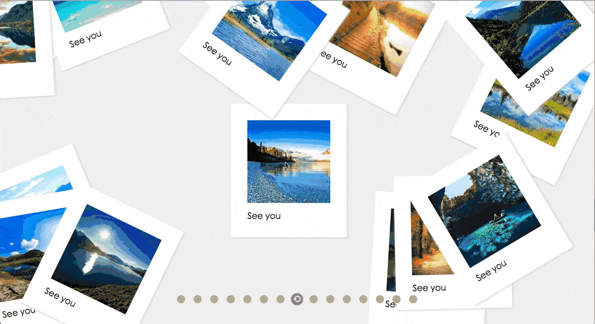

# Vue Gallery

> Photo gallery demo using vuejs 2.0

## Build Setup

``` bash
# install dependencies
npm install

# serve with hot reload at localhost:8080
npm run dev

# build for production with minification
# all the assets are placed under dist folder
npm run dist

# Deploy the project to gh-pages branch for demo
npm run deploy
```

For detailed explanation on how things work, consult the [docs for vue-loader](http://vuejs.github.io/vue-loader).

## Demo

Online address: https://vincenthou.github.io/vue-gallery



